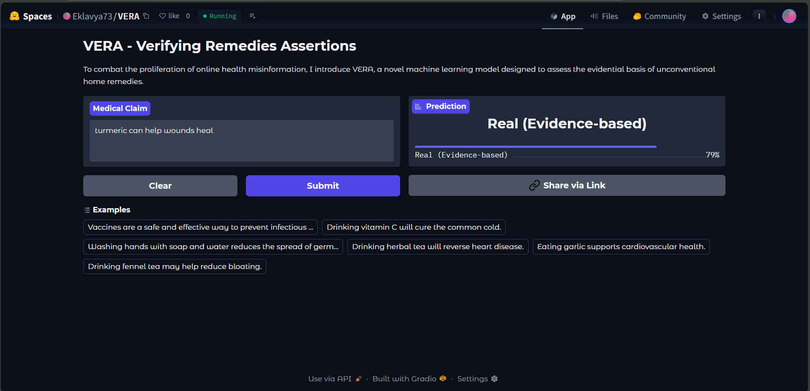
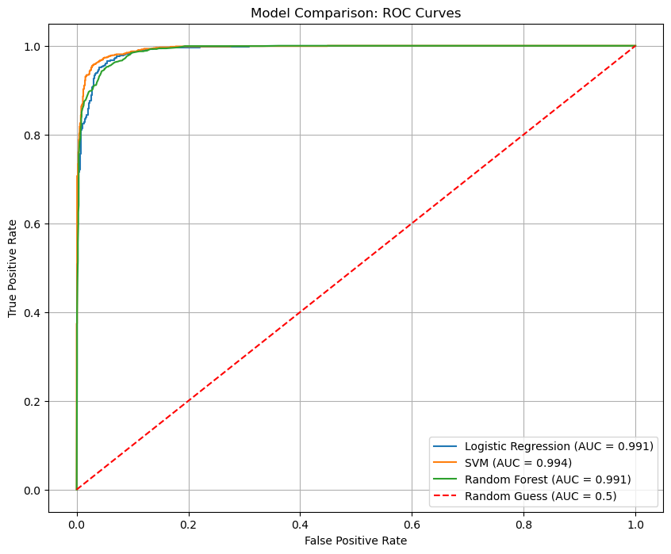

**VERA - Verifying Remedies Assertions**

This project is a machine learning web app designed to assess the evidential basis of unconventional home remedies and combat the proliferation of online health misinformation.

The model was trained on the train_data.csv dataset and is deployed as an interactive web app using Gradio.

**Click here to view the live app on Hugging Face Spaces!**
https://huggingface.co/spaces/Eklavya73/VERA

**App Preview**

**About The Project**

This repository contains all the code for the project, including:

1. The Jupyter Notebook used for data cleaning, analysis, and model comparison.

2. The saved (serialized) machine learning model and vectorizer.

3. The app.py file that runs the user-facing Gradio web app.

**Models Comparison**

During the analysis, three different models were trained and evaluated. The model with the best performance (based on AUC and F1-Score) was chosen for the final app.

**Model_________________Accuracy__________AUC Score__________F1-Score (Real)**

**SVM**____________________0.9612____________0.9938______________0.9616

**LR**______________________0.9523____________0.9907______________0.9531

**Random Forest**________0.9482____________0.9905______________0.9486

**Model Comparison ROC Curve**

**How to Run This Project**

1. Run the Web App Locally

To run the Gradio app on your own machine:

Clone the repository:
----git clone [your-repo-url]

Install requirements:
----pip install -r requirements.txt

Run the app:
----python app.py

Then open http://127.0.0.1:7860 in your browser.

2. Run the Notebook

To explore the data analysis and model training process, you can run the Jupyter Notebook:

Make sure you have Jupyter installed (pip install jupyterlab).

Navigate to the notebook/ directory.

Run jupyter lab and open the Model.ipynb file.

**File Structure**

1.VERA:\n
1.1----app.py__________________# The Gradio web app
1.2----requirements.txt________# Python libraries
1.3----best_model.joblib_______# The saved, trained model
1.4----vectorizer.joblib_______# The saved, fitted vectorizer
1.5----Model.ipynb_____________# Analysis & model training notebook
1.6----dataset.csv_____________# Original training data
2.README.md____________________# This file!
